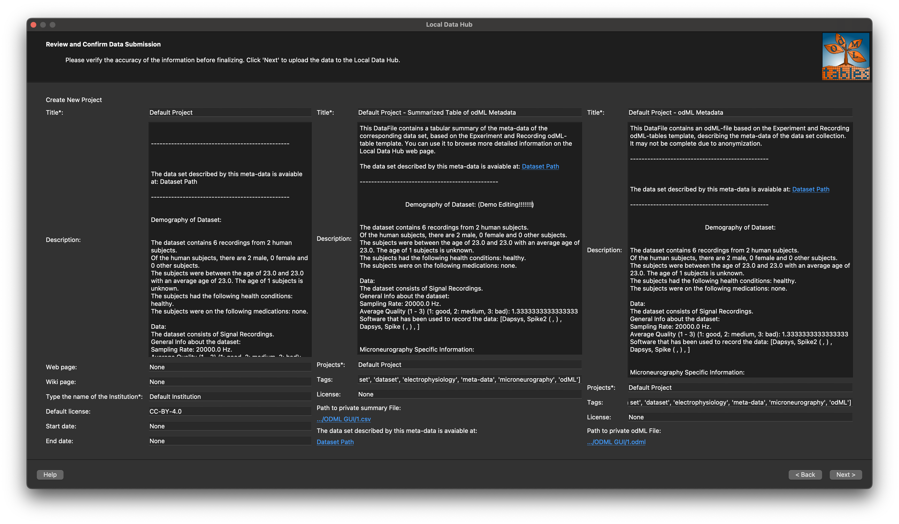

# odmltables-for-ldh

odMLtables - Local Data Hub Extension

--------------------------------------

OdMLtables is a graphical user interfacte that allows  to convert odML structures to and from table representations. This extension of the odMLtables GUI supports semi-automatic uploading of odML-meta-data of
microneurography recordings to the [Local Data Hubs by NFDI4Health](https://www.nfdi4health.de/service/local-data-hub.html). The Local Data Hubs can be installed using [Docker Deployment LDH](https://github.com/nfdi4health/ldh-deployment). More information about the LDH can be found on [Local Data Hub - Homepage](https://www.nfdi4health.de/service/local-data-hub.html)

The current version supports the streaming to the LDHs only for odML-files that comply to the Experiment and Recording template, which can be found in the [odMLtablesForMNG](https://github.com/Digital-C-Fiber/odMLtablesForMNG/tree/master)
repository. 

odMLtables provides a set of functions to simplify the setup, maintenance and usage of a metadata management structure using [odML](https://g-node.github.io/python-odml/).

In addition to the [Python API](https://www.python.org/), odMLtables provides its main functionality also via a graphical user interface.


## Publications

A techinal case report describing odmltables-for-ldh has been published [here](https://doi.org/10.3233/shti240836).
The concept that the odMLtabled for LDH follows, has been presented as a talk at GMDS 2024 and in poster at MIE2024. The slides of the talk, poster and corresponding abstract can be found under [the related publications folder](./publications/).

## How to contribute

Please feel free to fork this or submit pull requests to this repository. We are more than happy to link and include further extensions of this tool, e.g. including support for further odMLtabels from different domains than micorneurogrpahy here.
Please reach out to Ekaterina Kutafina or Mayra Elwes for questions and collaborations.


#

## Step-by-Step Guide on How to use the GUI! 

<table>
    <tr>
        <th>Step</th>
        <th>Description</th>
        <th>Image</th>
    </tr>
    <tr>
        <td><strong>Step 1: Starting Page</strong></td>
        <td>Open the odMLtables application. Click on <strong>Upload to Local Data Hubs</strong> to start uploading your data.</td>
        <td></td>
    </tr>
    <tr>
        <td><strong>Step 2: Connect to Local Data Hub</strong></td>
        <td>Enter the <strong>Local Data Hub URL</strong> and <strong>API token</strong>. These credentials are necessary to connect and interact with your LDH.</td>
        <td></td>
    </tr>
    <tr>
        <td><strong>Step 3: Select or Create a Project</strong></td>
        <td>Select an existing project or create a new one by clicking on <strong>Create New Project</strong> and filling in the necessary details.</td>
        <td><br></td>
    </tr>
    <tr>
        <td><strong>Step 4: File Selection</strong></td>
        <td>Choose the odML file for upload by selecting <strong>Browse for odML File to Publish</strong>. This step is mandatory to proceed.</td>
        <td></td>
    </tr>
    <tr>
        <td><strong>Step 5: Data Field Selection</strong></td>
        <td>Select which data fields you want to share. This step allows for editing your choices before final confirmation.</td>
        <td><br></td>
    </tr>
    <tr>
        <td><strong>Step 6: Review Data</strong></td>
        <td>Examine your data selections in a table format, making any last-minute changes by checking or unchecking fields as necessary.</td>
        <td><br></td>
    </tr>
    <tr>
        <td><strong>Step 7: Save and Finalize</strong></td>
        <td>Confirm your selections and specify where to save the cleaned odML and its CSV version within your project directory on the LDH.</td>
        <td></td>
    </tr>
    <tr>
        <td><strong>Step 8: Specify Dataset URL</strong></td>
        <td>Provide a link to your dataset if it is publicly available, or indicate if access requires authorization from the dataset authors.</td>
        <td></td>
    </tr>
    <tr>
        <td><strong>Step 9: Review and Confirm Data Submission</strong></td>
        <td>Finalize the submission by reviewing and editing project details, dataset descriptions, and metadata as necessary.</td>
        <td></td>
    </tr>
    <tr>
        <td><strong>Step 10: Publication Summary</strong></td>
        <td>View links to the project page, summary data file, and the odML data file, which can be accessed directly through the provided links.</td>
        <td></td>
    </tr>
</table>


## Setup

To integrate and use the odML GUI with LDH, follow the instructions below:

### Prerequisites

Ensure you have the odML GUI installed. You can download it from the [official odML GitHub repository](https://gitlab.com/BI_Koeln/odml-gui-for-ldh.git).

### Step-by-Step Guide

1. **Download odML GUI**:
   - Clone the odML GUI repository:
     ```sh
     git clone https://gitlab.com/BI_Koeln/odml-gui-for-ldh.git
     cd odml-gui-for-ldh
     ```

2. **Set Up the Python Environment**:
   - Create a Python virtual environment:
     ```sh
     python -m venv venv
     ```
   - Activate the virtual environment:
     - On Windows:
       ```sh
       venv\Scripts\activate
       ```
     - On macOS/Linux:
       ```sh
       source venv/bin/activate
       ```

3. **Install Required Packages**:
   - Install the required packages from `requirements_gui.txt`:
     ```sh
     pip install -r requirements_gui.txt
     ```

4. **Run the odML GUI Application**:
   - Start the GUI application:
     ```sh
     python odmltables-gui.py
     ```

---

## Step-by-Step guide to Create an API in NFDI4Health

- First Go to `http://localhost:3000/`.

<table>
  <tr>
    <th>Image</th>
    <th>Step-by-Step Guide</th>
  </tr>
  <tr>
    <td></td>
    <td><strong>Navigate to your user profile:</strong> Open the user interface and click on your profile name to access options related to your account and projects.</td>
  </tr>
  <tr>
    <td></td>
    <td><strong>Viewing project membership:</strong> Check the "Trial Projects I am a member of" section to see your current project memberships.</td>
  </tr>
  <tr>
    <td></td>
    <td><strong>Access user details:</strong> On your profile page, you can view your details such as location, expertise, and join date.</td>
  </tr>
  <tr>
    <td></td>
    <td><strong>Manage API tokens:</strong> Go to the API tokens section from your profile to view or manage your tokens.</td>
  </tr>
  <tr>
    <td></td>
    <td><strong>Creating a new API token:</strong> Click on "New API Token" to create a new token for API access.</td>
  </tr>
  <tr>
    <td></td>
    <td><strong>Configure new API token:</strong> Enter a title for your new API token to help identify its purpose.</td>
  </tr>
  <tr>
    <td></td>
    <td><strong>Complete token creation:</strong> After entering the title, click "Create" to generate your new API token.</td>
  </tr>
  <tr>
    <td></td>
    <td><strong>Copy the generated API token:</strong> Once created, make sure to copy your new API token as it will not be shown again.</td>
  </tr>
</table>


# Dependencies
------------

This extension is based on the original [odMLtables](https://github.com/INM-6/python-odmltables) modified by the [odMLtablesForMNG](https://github.com/Digital-C-Fiber/odMLtablesForMNG/tree/master) extension. 
Which are based on [odML](https://github.com/G-Node/python-odml).


# License
---------------------
BSD-3-Clause license